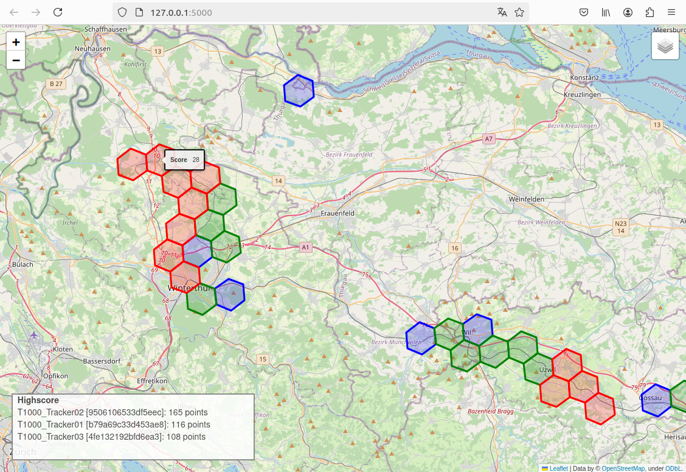

# wavemapper
*wavemapper_t1000_chirpstack* is an experimental game
about coverage mapping and usage of Helium IoT network.

SenseCAP T1000 LoRaWAN GPS trackers send their location over Helium infrastructure.
This Python code gets those uplinks via MQTT and generates a map with highscore.

Copyright (C) 2024 Stefan Braun

## example screenshot
- only first discovering of a hexagon increases the trackers score
- discovering one hexagon increases score of 1 plus sum of all neighbour hexagons
- blue means low activity, low score 
- green means medium activity, medium score
- red means high activity, high score. This is the front of the wave!

## setup LoRaWAN / MQTT part
todo: insert text